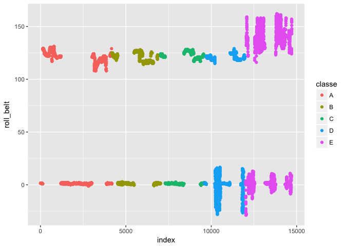
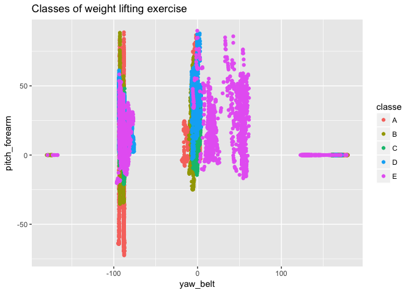
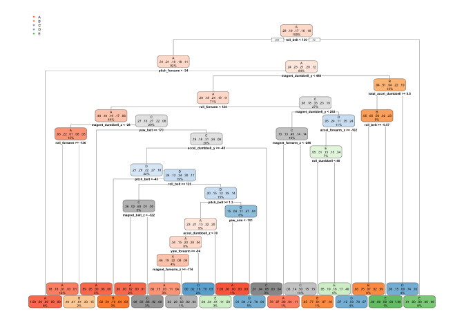
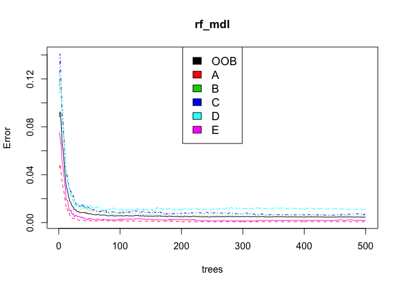
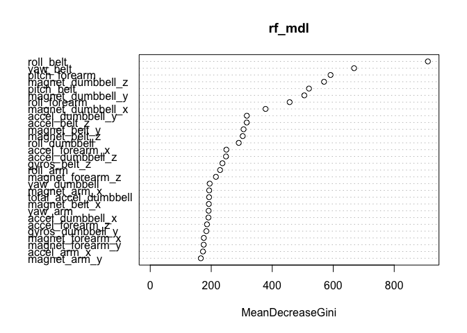

Introduction
============

Human Activity Recognition- **HAR** includes tracking and recognizing
from simple human activities like walking, running to more complex
activities like cooking,cleaning, etc. in a real life setting.
Recognizing and monitoring human activities is very crucial to provide
smarter and effective assistance in different fields of life. As an
example, say providing health care assistance to elderly people,
physically/mentally disable people, or even children.

With the invention of smartphones and wearable devices like Jawbone Up,
Nike FuelBand, and Fitbit collecting HAR data is much simpler, effective
and inexpensive but the big challenge is how to effective utilize the
data, how to find a pattern in the measurement taken from these type of
devices to improve the health and fitness of the user. Most of the
research on activity recognition mainly focuses on predicting "type of
activity" rather than predicting the quality or "how well the activity
is performed". In this project, my goal will be to use data from
accelerometers on the belt, forearm, arm, and dumbbell of 6 participants
and create a model that can predict whether the barbell lifts is correct
or incorrect. This project is inspired by the paper [Qualitative
Activity Recognition of Weight Lifting
Exercises](http://groupware.les.inf.puc-rio.br/har) by *Velloso,
Gellersen,Ugulino,Bulling,Fulks*

Data Description
----------------

Participants were asked to perform one set of 10 repetitions of the
Unilateral Dumbbell Biceps Curl in five different fashions: exactly
according to specification(classe A), throwing the elbows to the
front(Classe B), lifting the dumbbell only half(classe C),lowering the
dumbbell only halfway(classe D) and throwing the hips to front( Classe
E). Classe A is correct way of doing the lifting exercise and rest all
are incorrect way of doing it. Age of participant aged between **20-28**
years and weight of dumbbell **1.25kg**.

Data Cleansing and Processing.
------------------------------

The training and testing data set is download from the csv files
[pml-testing.csv](https://d396qusza40orc.cloudfront.net/predmachlearn/pml-training.csv)
and
[pml-training.csv](https://d396qusza40orc.cloudfront.net/predmachlearn/pml-testing.csv)
into Train\_data and Test\_data

The Train\_data dataset has 19622 observation and 160 variables while
the Test\_data has 20 observations

The dataset has 160 variables, all the variables may not necessarily
influence the prediction values **classe**. Before working on model
development process, lets trim and cleanse the data .

It is a good idea to drop all the variables that does not effect the
outcome variable like user\_name,timestamps, X (indicates the row
number). Column 1 to 7 is removed.

    ## [1] 19622   153

**Zero and near-zero variance predictors**  
Constant and almost constant predictors across samples are called zero
and near-zero variance predictors. This kind of predictor is not only
non-informative, it can break some models you may want to fit to your
data. Lets remove all the zero and near-zero variance using the

    library(randomForest)
    library(caret)
    nzv1 <- nearZeroVar(wl_data)
    filter_Wl_data <- wl_data[, -nzv1]
    dim(filter_Wl_data)

    ## [1] 19622    94

**Removing the NAs**

The NA or missing values may give errors during the training of models,
if it is not handled properly. Lets remove all the columns where more
90% of the data is NA, using the describe() function in psych package

    library(psych)
    d <- describe(filter_Wl_data)
    p <- d[d$n/dim(filter_Wl_data)[1] < 0.1,1]
    final_data <- filter_Wl_data[,-p]
    dim(final_data)

    ## [1] 19622    53

Partitioning the data into two set training test and testing test to
train modelas and validate it. 75% of data as training data and
remaining 25% as testing data.

    library(caret)
    set.seed(1117)
    dtrain <- createDataPartition(final_data$classe,
                                  p=0.75, list = FALSE)
    training <- final_data[dtrain,]
    testing <- final_data[-dtrain,]
    dim(training); dim(testing)

    ## [1] 14718    53

    ## [1] 4904   53

### Data Visualization

It important here to visualized the data and see if we can see some
concrete patterns that distinguise one class from the other classes.

I wanted to see the average roll\_belt data for each weight lifting
class. So I plotted the roll\_belt versus their index.

From the above plot, the only thing that can be infered is that, if the
roll\_belt measurement is more than 130 or if it is negative value the
weight lifting classes is most likely incorrect (classe E or Classe E
and D respectively).

Lets plot some more variables, to get some more insight about the data

Definitely, we see patterns when we plot variable *yaw\_belt* versus
variable *pitch\_forearm*. Lets explore different classification
algorithms to see which are important variables and which is the best
model.

Prediction Algorithms
---------------------

In this project, I have tried four different classification models :
Decision trees,Linear discriminant analysis,Generalized Boosted
Regression Modeling and Random forest. I computed the accuracy for each
of these models. The best classification model for this probelm was
selected the predicting the Test\_Data set.

### Decision Tree

Lets start with a Decision tree model forcalssification. It is one most
common and simplest classification algorithm. I use the rpart() functio
to create the decision tree.

    ##  Accuracy 
    ## 0.7373573

The accuracy is 0.7373573.

### Linear discriminant analysis (LDA)

LDA is a Classification algorithm to find a linear combination of
features that characterizes or seperates two or more classes of objects
or events. It is best to use when classification has more than 2
classes.

    ##  Accuracy 
    ## 0.7037113

### Generalized Boosted Regression Modeling (gbm)

It fits generalized boosted regression models.

    ##  Accuracy 
    ## 0.4967374

### Random Tree

Random Forest is an extension of the decision tree algorithm. The core
Idea behind Ranodm Forest is to generate multiple small decision trees
from random subsets of data.

    ## 
    ## Call:
    ##  randomForest(formula = classe ~ ., data = training) 
    ##                Type of random forest: classification
    ##                      Number of trees: 500
    ## No. of variables tried at each split: 7
    ## 
    ##         OOB estimate of  error rate: 0.47%
    ## Confusion matrix:
    ##      A    B    C    D    E  class.error
    ## A 4182    2    0    0    1 0.0007168459
    ## B   12 2832    4    0    0 0.0056179775
    ## C    0   14 2548    5    0 0.0074016362
    ## D    0    0   25 2386    1 0.0107794362
    ## E    0    0    1    4 2701 0.0018477458

Number of trees used in the fores is 500, which is default. The number
of predictive variables considered at each split within a tree is 7.

The random forest iteratively uses a different subset of the data to
make multiple decision trees. At each iteration, the tree created using
the subset is tested with the data that is not used to create the tree.
The average of errors of all these interactions is the Out of Bag Error
(**OOB**). For this model OOB error is 0.46%

Lets use the plot() function in random Forest. This plot helps decide
how many trees to have in the model. On the y-axis is the error of the
model and the x-axis is the number of trees used.

The red, green, blue, aqua, pink curves is for classe A,B,C, D,E
respectively while the black curve is the Out-of-Bag error rate. when
using between 0 - 20 trees the error remains quite high, but drops and
flattens out at around 60 trees. There is no additional drop for any
classes after 100 trees, therefore no need to include additional trees
to the model.

The variable importance plot gives the importance of each variable when
classifying the data. The mean decrease gini is a measure of how each
variable contributes to the purity on each node in a tree.

From the plot above, the most important variable as per the random
forest model above is roll\_belt.

Lets predict the testing data and compute the accuracy.

    ## Confusion Matrix and Statistics
    ## 
    ##           Reference
    ## Prediction    A    B    C    D    E
    ##          A 1395    3    0    0    0
    ##          B    0  944    5    0    0
    ##          C    0    2  849    3    0
    ##          D    0    0    1  800    3
    ##          E    0    0    0    1  898
    ## 
    ## Overall Statistics
    ##                                           
    ##                Accuracy : 0.9963          
    ##                  95% CI : (0.9942, 0.9978)
    ##     No Information Rate : 0.2845          
    ##     P-Value [Acc > NIR] : < 2.2e-16       
    ##                                           
    ##                   Kappa : 0.9954          
    ##  Mcnemar's Test P-Value : NA              
    ## 
    ## Statistics by Class:
    ## 
    ##                      Class: A Class: B Class: C Class: D Class: E
    ## Sensitivity            1.0000   0.9947   0.9930   0.9950   0.9967
    ## Specificity            0.9991   0.9987   0.9988   0.9990   0.9998
    ## Pos Pred Value         0.9979   0.9947   0.9941   0.9950   0.9989
    ## Neg Pred Value         1.0000   0.9987   0.9985   0.9990   0.9993
    ## Prevalence             0.2845   0.1935   0.1743   0.1639   0.1837
    ## Detection Rate         0.2845   0.1925   0.1731   0.1631   0.1831
    ## Detection Prevalence   0.2851   0.1935   0.1741   0.1639   0.1833
    ## Balanced Accuracy      0.9996   0.9967   0.9959   0.9970   0.9982

The model accuracy is 0.99 , which is more than any other model

### Final Model

As the random forest model gives the best prediction, I will use this
model to predict the classification for Test\_data.

**Predicting the data set**

    pred_test_data <- predict(rf_mdl, Test_data)

    # reading the predicted value in csv file

    c <- cbind(Test_data,pred_test_data)
    New_Test_data <- c[,-160]
    write.csv(New_Test_data, file = "new-pml-test.csv")

The predicted outcome for the Test\_data set using the RandomForest
Model is **B, A, B, A, A, E, D, B, A, A, B, C, B, A, E, E, A, B, B, B**
